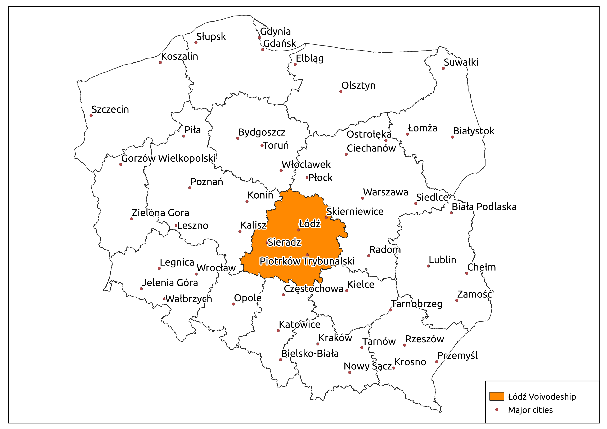
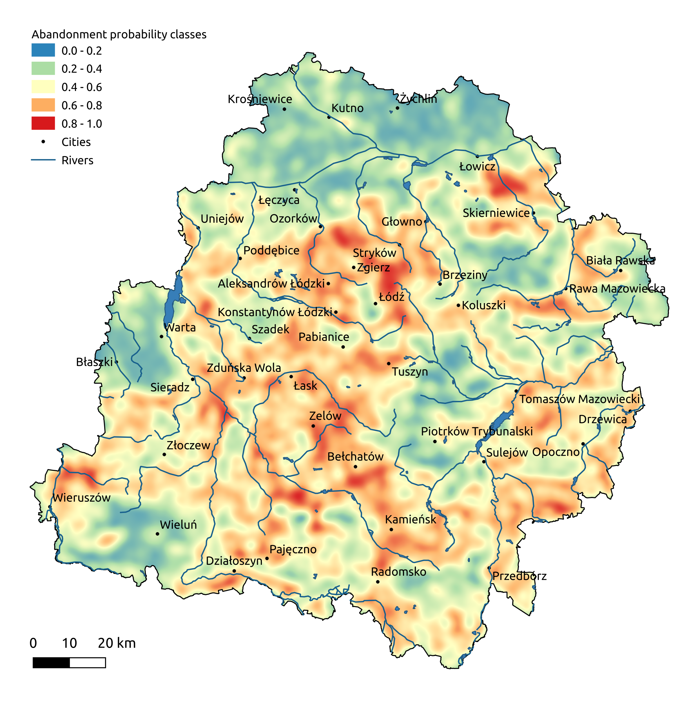

# Detecting Land Abandonment in Łódź Voivodeship Using Convolutional Neural Networks

**University of Lodz, Faculty of Geographical Sciences, Department of Physical Geography**:

Stanisław Krysiak ([OCRID](https://orcid.org/0000-0002-8131-6386
)), Elżbieta Papińska ([OCRID](https://orcid.org/0000-0002-7981-3439)), Anna Majchrowska ([OCRID](https://orcid.org/0000-0002-1611-6118)) 

**SoftwareMill**:

Maciej Adamiak ([OCRID](https://orcid.org/0000-0002-8229-9661), [LinkedIn](https://www.linkedin.com/in/maciejadamiak/)), Mikołaj Koziarkiewicz ([OCRID](https://orcid.org/0000-0002-6796-1688), [LinkedIn](https://www.linkedin.com/in/miko%C5%82aj-k-05a0428/))

## Abstract
A combination of wide availability of multi-spectral satellite imagery through projects such as Landsat and Sentinel, and the introduction of deep learning in general, and Convolutional Neural Networks (CNNs) in particular, allowed for rapid and effective analysis in multiple classes of problems pertaining to land coverage. Taking advantage of the two phenomena, we propose a machine learning model for classification of land abandonment. We designed a Convolutional Neural Network architecture that outputs a classification probability for the presence of land abandonment in a given 15-25 ha grid element, using multi-spectral imaging data obtained through Sentinel Hub. For both training and validation of the model, we used imagery of the Łódź voivodeship in central Poland. The main source of truth was a 2009 orthophoto study available from the WMS (Web Map Service) of the Geoportal site. The model achieved 0.855 auc (area under curve), 0.47 loss and 0.78 accuracy for the test dataset. Using the classification results, and the Getis-Ord Gi* statistic, we have prepared a map of cold- and hotspots with individual areas exceeding 50 km². This thresholded heatmap allowed for an analysis of contributing factors for both low and intense land abandonment, demonstrating that common trends are identifiable through interpretation of classification results of the chosen model. We have additionally performed a comparative field study on two selected cold- and hotspots. The study, along with the high-accuracy results of the model's validation, confirm that CNN-type models are an effective tool for automatic detection of land abandonment.

**Keywords**: land cover, land abandonment, GIS, machine learning, convolutional neural networks, Łódź Voivodeship
